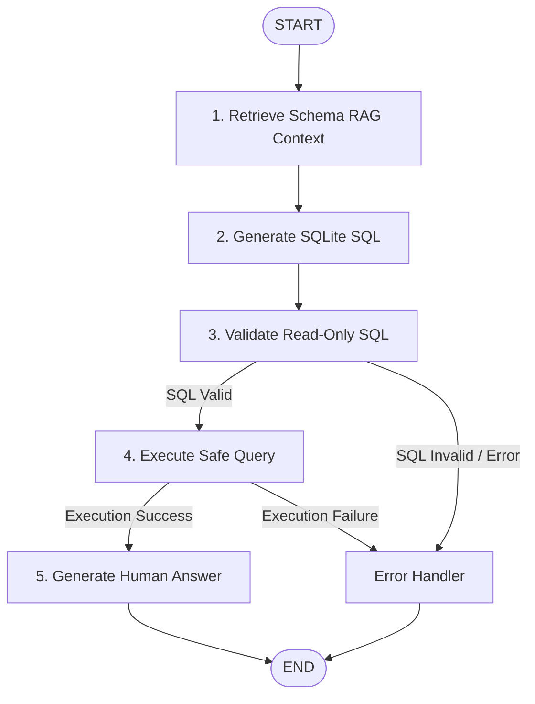

# workday-query-agent-

#github link https://github.com/Raksha-A-prodapt/workday-query-agent-

# Workday HR Analytics AI Assistant

An enterprise-grade, schema-grounded natural-language reporting and analytics agent for Workday-style HR databases. Built with **FastAPI**, **LangGraph**, **ChromaDB**, **SQLite**, **LangSmith**, and **React + Vite**.


---

## 🌟 Features & Key Capabilities

- **Natural Language HR Querying**: Ask questions in plain English (e.g., *"How many active employees are on leave by region?"*).
- **Schema-Grounded RAG Retrieval**: Queries ChromaDB vector database populated with `data_dictionary.md` to ground queries strictly within allowed tables, columns, and business rules.
- **StateGraph Workflow Orchestration**: Powered by **LangGraph**, featuring conditional error handling, step-by-step state tracking, and deterministic routing.
- **Read-Only SQL Validation Engine**: AST and keyword validator ensuring **100% read-only safety**. Rejects non-`SELECT` statements (`UPDATE`, `DELETE`, `DROP`, `ALTER`, etc.) and multi-statement attacks.
- **Safe Execution Engine**: Executes validated read-only SQLite queries against `workday_hr.db` with connection isolation.
- **Zero-Hallucination Answer Generation**: Synthesizes accurate, natural-language business answers from returned execution rows, backed by deterministic fallback mappings for aggregate aliases.
- **Production Observability & Tracing**: Full **LangSmith** integration tracing the complete pipeline (`Workday HR Query`, schema retrieval, SQL generation, validation, safe execution, and LLM completions).
- **Modern Interactive Dashboard**: Premium React UI featuring responsive data tables, expandable SQL Query Inspector, real-time step status badges, and sample question prompts.

---

## 🔄 End-to-End Workflow Architecture



---

## 📊 Database Schema & Data Dictionary

The synthetic `workday_hr.db` database models an enterprise HR system:

| Table | Primary Key | Key Columns & Descriptions |
| :--- | :--- | :--- |
| `departments` | `department_id` | Department names, cost centers, manager IDs, budget |
| `regions` | `region_id` | Global regions (e.g., North America, EMEA, APAC), country, office location |
| `employees` | `employee_id` | Name, job title, department ID, region ID, employment status (`Active`, `Terminated`, `On Leave`), hire date, salary |
| `leave_records` | `leave_id` | Employee ID, leave type (`Vacation`, `Sick`, `Parental`), start/end dates, approval status (`Approved`, `Pending`, `Rejected`) |
| `job_openings` | `job_id` | Title, department ID, region ID, hiring manager ID, position status (`Open`, `Filled`, `Cancelled`), posted date |

---

## 📁 Repository Structure

```
workday-data-query-agent/
├── backend/
│   ├── api/                 # FastAPI routes (/query, /schema, /health)
│   ├── core/                # Centralized Settings & LangSmith configuration
│   ├── database/            # SQLite database initialization & workday_hr.db
│   ├── models/              # Pydantic schemas & request/response payloads
│   ├── rag/                 # ChromaDB schema vector retriever & ingestion
│   ├── services/            # LLM provider wrapper & human answer generator
│   ├── sql/                 # SQL prompts, generator, AST validator & executor
│   ├── workflow/            # LangGraph StateGraph, nodes, state & orchestrator
│   ├── tests/               # Pytest suite (90 test cases)
│   ├── main.py              # FastAPI app initialization & CORS middleware
│   └── requirements.txt     # Python dependencies
├── frontend/
│   ├── src/                 # React components (QueryInput, ResultsTable, SQLInspector, StatusBadge)
│   ├── package.json         # Frontend dependencies & Vite setup
│   └── index.css            # Dark mode design system & micro-animations
├── .env.example             # Environment variable template
├── ARCHITECTURE.md          # Comprehensive architectural document
└── README.md                # Project documentation
```

---

## ⚙️ Quick Start & Installation

### Prerequisites

- **Python**: `3.11` or higher
- **Node.js**: `18.0` or higher & `npm`

### 1. Environment Setup

Copy `.env.example` to create `.env` in the root directory:

```bash
cp .env.example .env
```

Configure your environment variables in `.env`:

```env
# ==========================================
# LLM Configuration
# ==========================================
LLM_PROVIDER=openai
OPENAI_API_KEY=your_openai_api_key_here
OPENAI_MODEL=gpt-4o-mini
OPENAI_BASE_URL=https://api.openai.com/v1

# ==========================================
# LangSmith Tracing & Observability
# Set LANGSMITH_TRACING=true and supply your key to enable tracing.
# Tracing stays disabled safely if LANGSMITH_API_KEY is missing or LANGSMITH_TRACING=false.
# ==========================================
LANGSMITH_TRACING=true
LANGSMITH_API_KEY=your_langsmith_api_key_here
LANGSMITH_PROJECT=workday-hr-ai-assistant
LANGSMITH_ENDPOINT=https://api.smith.langchain.com
```

### 2. Backend Setup

```bash
# Install Python dependencies
pip install -r backend/requirements.txt

# Run FastAPI backend server
uvicorn backend.main:app --reload --port 8000
```

Backend API will be accessible at:
- **API Server**: `http://localhost:8000`
- **Swagger Docs**: `http://localhost:8000/docs`

### 3. Frontend Setup

In a separate terminal:

```bash
cd frontend

# Install Node dependencies
npm install

# Start Vite dev server
npm run dev
```

Frontend application will be accessible at `http://localhost:5173`.

---

## 🔍 Observability & Tracing with LangSmith

This project features native **LangSmith** tracing for complete visibility into the AI agent workflow.

### Enabled Trace Spans
- `Workday HR Query`: Root trace tracking the overall question lifecycle and final state.
- `Retrieve Schema Context`: ChromaDB vector search retrieval span.
- `Generate SQL`: LLM SQL synthesis turn.
- `Validate SQL`: Read-only AST and safety validation step.
- `Execute Safe SQL`: SQLite database query execution span.
- `Generate Answer`: Human-readable answer synthesis turn.
- `LLM Completion`: Sub-spans tracking raw OpenAI prompt payloads and completions.

### Safety Guarantee
If `LANGSMITH_API_KEY` is not set or `LANGSMITH_TRACING=false`, tracing is disabled gracefully without throwing errors or blocking execution.

---

## 🧪 Running Automated Tests

Run the full pytest suite covering unit, integration, RAG, SQL validation, workflow state, API, and LangSmith test cases:

```bash
pytest backend/tests
```

```
============================= 90 passed in 18.91s =============================
```

---

## 🛡️ Security & Read-Only Safety

1. **Read-Only SQL Constraints**: Enforces that generated SQL statements start with `SELECT` or `WITH ... SELECT`.
2. **Forbidden Keywords**: Rejects any queries containing `INSERT`, `UPDATE`, `DELETE`, `DROP`, `ALTER`, `CREATE`, `REPLACE`, `PRAGMA`, `ATTACH`, `VACUUM`.
3. **Multi-Statement Blocking**: Rejects semicolon-separated multi-statement execution.
4. **Database Connection Isolation**: Opens SQLite database connections with read-only flags to guarantee data immutability.
